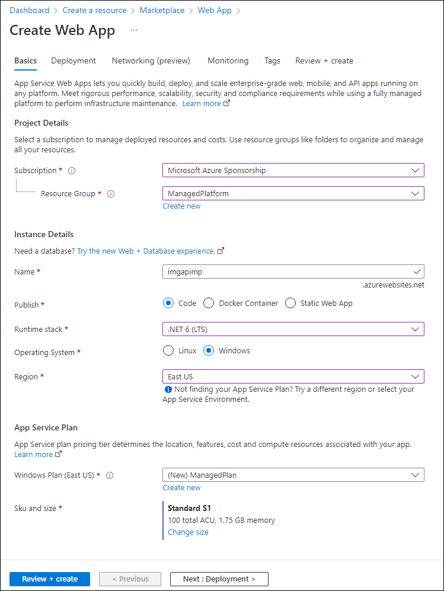

# AZ-204 Staff training

This repo is a partial copy of https://github.com/MicrosoftLearning/AZ-204-DevelopingSolutionsforMicrosoftAzure.
More precisely, this is only Lab01 with simplified instruction allowing an almost straight forward use from Cloud Shell.
All rights reserved to Microsoft.

# Lab 01: Build a web application on Azure platform as a service offering

## Microsoft Azure user interface

Given the dynamic nature of Microsoft cloud tools, you might experience Azure UI changes that occur after the
development of this training content. As a result, the lab instructions and lab steps might not align correctly.

Microsoft updates this training course when the community alerts us to needed changes. However, cloud updates occur
frequently, so you might encounter UI changes before this training content updates. **If this occurs, adapt to the
changes, and then work through them in the labs as needed.**

## Instructions

## Architecture diagram


### Exercise 1: Build a backend API by using Azure Storage and the Web Apps feature of Azure App Service

#### Task 1: Prepare the environment

1. Download the images from the Teams chat.

2. Open an Internet browser

3. In the browser, go to the Azure portal (<https://portal.azure.com>), and then sign in with the account
   you'll be using for this lab.

   > **Note**: If this is your first time signing in to the Azure portal, you'll be offered a tour of the portal. If you
   prefer to skip the tour, select **Maybe later** to begin using the portal.

4. In the Azure portal, select the **Cloud Shell** icon   to open a
   new Bash session. If Cloud Shell defaults to a PowerShell session, select **PowerShell**, and in the drop-down menu,
   select **Bash**.

   > **Note**: If this is the first time you're starting **Cloud Shell**, when prompted to select either **Bash** or **
   PowerShell**, select **PowerShell**. When you're presented with the **You have no storage mounted** message, select
   the subscription you're using in this lab, and then select **Create storage**.

5. In the cloud shell, clone the training repository :

   ```
   git clone https://github.com/vmille/az-204-staff-training.git
   ```

#### Task 2: Create a Storage account

1. In the Azure portal, use the **Search resources, services, and docs** text box to search for **Storage Accounts**,
   and then in the list of results, select **Storage Accounts**.

2. On the **Storage accounts** blade, select **+ Create**.

3. On the **Create a storage account** blade, on the **Basics** tab, perform the following actions, and then select **
   Review**:

| Setting                             | Action                                                                   |
|-------------------------------------|--------------------------------------------------------------------------|
| **Subscription** drop-down list     | Retain the default value                                                 |
| **Resource group** section          | Select **Create new**, enter **ManagedPlatform**, and then select **OK** |
| **Storage account name** text box   | Enter **imgstor**_[yourname]_                                            |
| **Region** drop-down list           | Select **(US) East US**                                                  |
| **Performance** section             | Select the **Standard** option                                           |
| **Redundancy** drop-down list       | Select **Locally-redundant storage (LRS)**                               |

The following screenshot displays the configured settings on the **Basics** tab of the **Create a storage account**
blade.


1. On the **Review** tab, review the options that you selected during the previous steps.

2. Select **Create** to create the storage account by using your specified configuration.

   > **Note**: Wait for the creation task to complete before you proceed with this lab.

3. On the **Overview** blade, select the **Go to resource** button to navigate to the blade of the newly created storage
   account.

4. On the **Storage account** blade, in the **Security + networking** section, select **Access keys**.

5. On the **Access keys** blade, select **Show keys**.

6. Review any one of the keys, and then copy the value of either of the **Connection string** boxes to the clipboard.

   > **Note**: It doesn't matter which connection string you choose. They are interchangeable.

7. Open Notepad, and then paste the copied connection string value to Notepad. You'll use this value later in this lab.

#### Task 3: Upload a sample blob

1. On the **Storage Account** blade, in the **Data storage** section, select the **Containers** link.

2. On the **Containers** blade, select **+ Container**.

3. In the **New container** window, perform the following actions:

| Setting                      | Action                                                                             |
|------------------------------|------------------------------------------------------------------------------------|
| **Name** text box            | Enter **images**                                                                   |
| **Public access level** list | Select **Blob (anonymous read access for blobs only)**, and then select **Create** |

1. On the **Containers** blade, select the newly created **images** container.

2. On the **images** blade, select **Upload**.

3. In the **Upload blob** window, perform the following actions:

| Setting                                        | Action                                                                                             |
|------------------------------------------------|----------------------------------------------------------------------------------------------------|
| **Files** section                              | Select the **Folder** icon                                                                         |
| **File Explorer** window                       | Browse to the photos you download, select the **grilledcheese.jpg** file, and then select **Open** |
| **Overwrite if files already exist** check box | Ensure that the check box is selected, and then select **Upload**                                  |

> **Note**: Wait for the blob to upload before you continue with this lab.

#### Task 4: Create a web app

1. On the Azure portal's navigation pane, select **Create a resource**.

2. On the **Create a resource** blade, in the **Search services and marketplace** text box, enter **Web App**, and then
   select Enter.

3. On the **Marketplace** search results blade, select the **Web App** result.

4. On the **Web App** blade, select **Create**.

5. On the **Create Web App** blade, on the **Basics** tab, perform the following actions, and then select the **
   Monitoring** tab:

| Setting                            | Action                                                                                                  |
|------------------------------------|---------------------------------------------------------------------------------------------------------|
| **Subscription** drop-down list    | Retain the default value                                                                                |
| **Resource group** section         | Select **ManagedPlatform**                                                                              |
| **Name** text box                  | Enter **imgapi**_[yourname]_                                                                            |
| **Publish** section                | Select **Code**                                                                                         |
| **Runtime stack** drop-down list   | Select **.NET 6 (LTS)**                                                                                 |
| **Operating System** section       | Select **Windows**                                                                                      |
| **Region** drop-down list          | Select the **East US** region                                                                           |
| **Windows Plan (East US)** section | Select **Create new**, enter the value **ManagedPlan** in the **Name** text box, and then select **OK** |
| **SKU and size** section           | Retain the default value                                                                                |

The following screenshot displays the configured settings on the **Create web app** blade.



1. On the **Monitoring** tab, in the **Enable Application Insights** section, select **No**, and then select **Review +
   create**.

2. On the **Review + create** tab, review the options that you selected during the previous steps.

3. Select **Create** to create the web app by using your specified configuration.

   > **Note**: Wait for the web app to be created before you continue with this lab.

4. On the **Overview** blade, select the **Go to resource** button to navigate to the blade of the newly created web
   app.

#### Task 5: Configure the web app

1. On the **App Service** blade, in the **Settings** section, select the **Configuration** link.

2. In the **Configuration** section, perform the following actions, select **Save**, and then select **Continue**.

| Setting                                        | Action                                                                                                                  |
|------------------------------------------------|-------------------------------------------------------------------------------------------------------------------------|
| **Application settings** tab                   | Select **New application setting**                                                                                      |
| **Add/Edit application setting** pop-up dialog | In the **Name** text box, enter **StorageConnectionString**                                                             |
| **Value** text box                             | Paste the storage connection string that you previously copied to Notepad                                               |
| **Deployment slot setting** text box           | Retain the default value, and then select **OK** to close the pop-up dialog and return to the **Configuration** section |

Wait for your application settings to save before you continue with the lab.

1. On the **App Service** blade in the **Settings** section, select the **Properties** link.

2. In the **Properties** section, copy the value of the **URL** hyperlink, and then paste it to Notepad. You'll use this
   value later in the lab.

   > **Note**: At this point, the web server at this URL will return a placeholder webpage. You haven't deployed any
   code to the Web App yet. You'll deploy code to the Web App later in this lab.

#### Task 6: Deploy an `ASP.NET` web application to Web Apps

1. In the Cloud Shell, enter the following command, and then select Enter to list all the apps in your **
   ManagedPlatform** resource group:

    ```
    az webapp list --resource-group ManagedPlatform
    ```

2. Enter the following command, and then select Enter to find the apps that have the **imgapi** prefix:

    ```
    az webapp list --resource-group ManagedPlatform --query "[?starts_with(name, 'imgapi')]"
    ```

3. Enter the following command, and then select Enter to render only the name of the single app that has the **imgapi**
   prefix:

    ```
    az webapp list --resource-group ManagedPlatform --query "[?starts_with(name, 'imgapi')].{Name:name}" --output tsv
    ```

4. Enter the following command, and then select Enter to change the current directory to the **
   az-204-staff-training/API** directory that contains the lab files:

    ```
    cd ~/az-204-staff-training/API
    ```

5. Enter the following command, and then select Enter to deploy the **api.zip** file to the web app that you created
   previously in this lab:

    ```
    az webapp deployment source config-zip --resource-group ManagedPlatform --src api.zip --name <name-of-your-api-app>
    ```

   > **Note**: Replace the *\<name-of-your-api-app\>* placeholder with the name of the web app that you created previously
   > in this lab. You recently queried this app’s name in the previous steps.

Wait for the deployment to complete before you continue with this lab.

1. On the Azure portal's **navigation** pane, select the **Resource groups** link.

2. On the **Resource groups** blade, select the **ManagedPlatform** resource group that you created previously in this
   lab.

3. On the **ManagedPlatform** blade, select the **imgapi**_[yourname]_ web app that you created previously in this lab.

4. From the **App Service** blade, select **Browse**.

   > **Note**: The **Browse** command will perform a GET request to the root of the website, which returns a JavaScript
   > Object Notation (JSON) array. This array should contain the URL for your single uploaded image in your Storage account.

#### Review

In this exercise, you created a web app in Azure, and then deployed your `ASP.NET` web application to Web Apps by using
the Azure CLI and Apache Kudu zip file deployment utility.

### Exercise 2: Build a front-end web application by using Azure Web Apps

#### Task 1: Create a web app

1. On the Azure portal's **navigation** pane, select **Create a resource**.

2. On the **Create a resource** blade, in the **Search services and marketplace** text box, enter **Web App**, and then
   select Enter.

3. On the **Marketplace** search results blade, select **Web App**.

4. On the **Web App** blade, select **Create**.

5. On the **Create Web App** blade, on the **Basics** tab, perform the following actions, and then select the **
   Monitoring** tab:

| Setting                            | Action                        |
|------------------------------------|-------------------------------|
| **Subscription** drop-down list    | Retain the default value      |
| **Resource group** section         | Select **ManagedPlatform**    |
| **Name** text box                  | Enter **imgweb**_[yourname]_  |
| **Publish** section                | Select **Code**               |
| **Runtime stack** drop-down list   | Select **.NET 6 (LTS)**       |
| **Operating System** section       | Select **Windows**            |
| **Region** drop-down list          | Select the **East US** region |
| **Windows Plan (East US)** section | Select **ManagedPlan (S1)**   |

The following screenshot displays the configured settings on the **Create web app** blade.


1. On the **Monitoring** tab, in the **Enable Application Insights** section, select **No**, and then select **Review +
   create**.

2. From the **Review + create** tab, review the options that you selected during the previous steps.

3. Select **Create** to create the web app by using your specified configuration.

   > **Note**: Wait for the creation task to complete before you continue with this lab.

4. On the **Overview** blade, select the **Go to resource** button to navigate to the blade of the newly created web
   app.

#### Task 2: Configure a web app

1. On the **App Service** blade, in the **Settings** section, select the **Configuration** link.

2. In the **Configuration** section, perform the following actions, select **Save**, and then select **Continue**:

| Setting                                        | Action                                                                                                                                                                                                     |
|------------------------------------------------|------------------------------------------------------------------------------------------------------------------------------------------------------------------------------------------------------------|
| **Application settings** tab                   | Select **New application setting**                                                                                                                                                                         |
| **Add/Edit application setting** pop-up dialog | In the **Name** text box, enter **ApiUrl**                                                                                                                                                                 |
| **Value** text box                             | Enter the web app URL that you copied previously in this lab. **Note**: Make sure you include the protocol **https://**, in the URL that you copy into the **Value** text box for this application setting |
| **Deployment slot setting** text box           | Retain the default value, and then select **OK**                                                                                                                                                           |

> **Note**: Wait for the application settings to save before you continue with this lab.

#### Task 3: Deploy an `ASP.NET` web application to Web Apps

1. Enter the following command, and then select Enter to list all the apps in your **ManagedPlatform** resource group:

    ```
    az webapp list --resource-group ManagedPlatform
    ```
 
2. Enter the following command, and then select Enter to change the current directory to the **
   az-204-staff-training/Web** directory that contains the lab files:

    ```
    cd ~/az-204-staff-training/Web
    ```

3. Enter the following command, and then select Enter to deploy the **web.zip** file to the web app that you created
   previously in this lab:

    ```
    az webapp deployment source config-zip --resource-group ManagedPlatform --src web.zip --name <name-of-your-web-app>
    ```

   > **Note**: Replace the *\<name-of-your-web-app\>* placeholder with the name of the web app that you created previously
   > in this lab. You recently queried this app’s name in the previous steps.

Wait for the deployment to complete before you continue with this lab.

1. On the Azure portal's **navigation** pane, select **Resource groups**.

2. On the **Resource groups** blade, select the **ManagedPlatform** resource group that you created previously in this
   lab.

3. On the **ManagedPlatform** blade, select the **imgweb**_[yourname]_ web app that you created previously in this lab.

4. On the **App Service** blade, select **Browse**.

5. Observe the list of images in the gallery. The gallery should list a single image that was uploaded to Storage
   previously in the lab.

6. In the **Contoso Photo Gallery** webpage, in the **Upload a new image** section, perform the following actions:

   a. Select **Browse**.

   b. In the **File Explorer** window, browse to **Download**, select the **bahnmi.jpg** file, and then select **Open**
   .

   c. Select **Upload**.

7. Observe that the list of gallery images has updated with your new image.

   > **Note**: In some rare cases, you might need to refresh your browser window to retrieve the new image.

#### Review

In this exercise, you created an Azure web app and deployed an existing web application’s code to the resource in the
cloud.

### Exercise 3: Clean up your subscription

#### Task 1: Delete resource groups

1. On the **Cloud Shell** pane, run the following command to delete the **ManagedPlatform** resource group:

    ```
    az group delete --name ManagedPlatform --no-wait --yes
    ```

   > **Note**: The command executes asynchronously (as determined by the *--no-wait* parameter). While you'll be able to
   run another Azure CLI command immediately after the command executes, within the same Bash session, it'll take a few
   minutes before the resource groups are actually removed.

2. Close the **Cloud Shell** pane in the portal.

#### Review

In this exercise, you cleaned up your subscription by removing the resource groups used in this lab.
